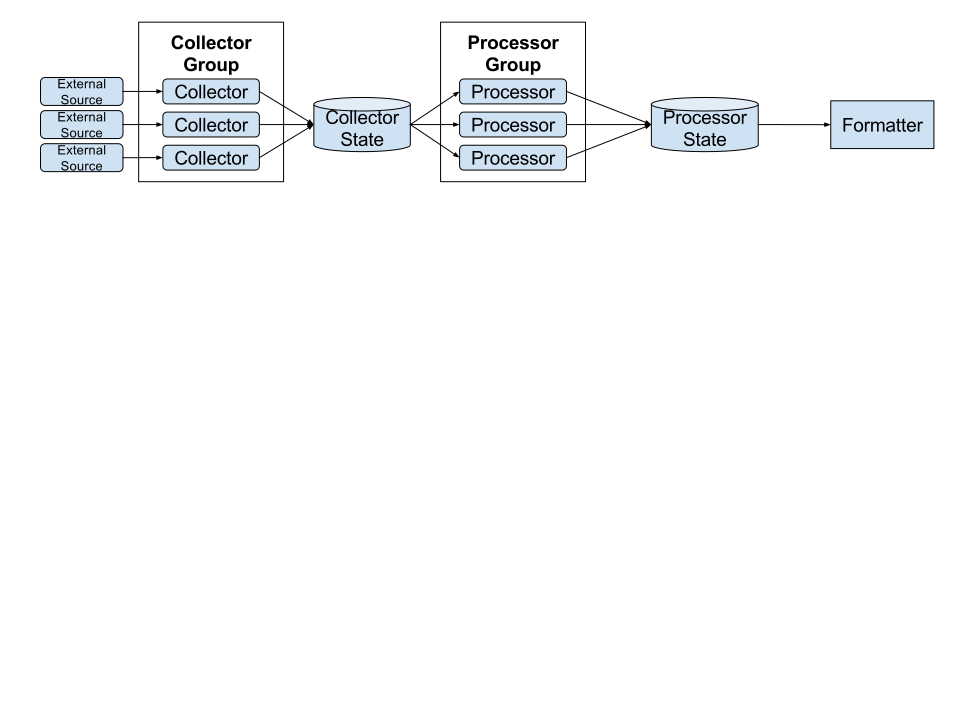

AMOlyst
=======

This project aims to **extract** data from various sources, **transform** it in an
easy way to provide interesting metrics, and finally **load** it into a target.

The initial prototype is aimed at doing this in the context of
addons.mozilla.org, where data is extracted from the AMO database and the
addons-linter validator results.





Usage
-----

Please make a connection to the AMO database available. You can do so using the
following command, or modify config.json with parameters.

```bash
$ docker-machine ssh addons-dev -L 3307:mysqld:3306
```

You can also drop in validation results into `data/validator`, for example this
one:

```json
{"count":1,"summary":{"errors":0,"notices":0,"warnings":1},"metadata":{"id":"amotabclose@mozilla.kewis.ch","manifestVersion":2,"name":"AMO Tab Closer","type":1,"version":"1.0","architecture":"extension","emptyFiles":[],"jsLibs":{}},"errors":[],"notices":[],"warnings":[{"_type":"warning","code":"FOUND_REQUIRE","message":"","description":"","detail":"react","column":13,"file":"background.js","line":3}]}
```

The above json uses a slightly modified validator that will emit warnings for
specific code attributes.
